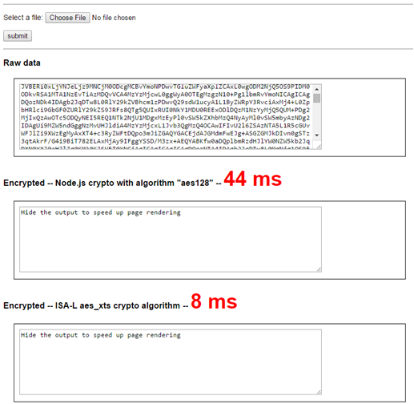

ISA-L integration with Node.js
=============================
## About This Document
This document describes ISA-L integration with Node.js. It's aiming to empower Node.js users with Intel ISA-L algrithoms to accelerate storage functionalities on Intel architectures.

This document also describes the strategies about integrating ISA-L into Node.js and provides an example demonstrating how efficient ISA-L is working with Node.js.

## Overview
With web & HTML5 technologies development, Node.js has been adopted by more and more companies to build fast scable web applications. Node.js is perfect for data-intensive real-time applications that run across distributed devices because it uses an event-driven, non-blocking I/O programming model.

The Intel Intelligent Storage Acceleration Library(Intel ISA-L) is a collection of functions used in storage applications highly optimized for Intel architectures. The ISA-L functions are designed to deliver performance beyond what optimized compilers alone can deliver. Its core functions are assembly language.

Node.js can largely improve I/O latency and would be very suitable for [IO bound](http://en.wikipedia.org/wiki/I/O_bound) senarioes. While working with ISA-L, Node.js can also get benefits in storage applications.

## Build Node-ISAL
This section describes how to build ISA-L into Node.js and expose its API through Node.js addon.

The ISA-L is developped by pure C language. The library has hundreds of functions (~200) exposed as API, covering the data storage related areas. They are grouped into serveral categories such as CRC, RAID, Erase Code, Hashing functions and so on.

The Node.js uses addon technology to wrap C/C++ libraries. Please reference to Node.js [Addons](https://nodejs.org/api/addons.html) documentation about developping Node.js addon.

I have pushed the Node.js addon source code into github repository. Please get it from [https://github.com/yejingfu/node-isal](https://github.com/yejingfu/node-isal). And before going forwards, please prepare ISA-L source code. and ensure the module file (`libisa-l.a`) and header files are ready and flagged by the environment variable "ISAL_HOME".

- Create project

Then create a Node.js addon for ISA-L. Name it as "node-isal". When the project is created, the file structure is like below:

    |- package.json
    |- binding.gyp
    |- index.js
    |- src
        |- main.cc
    |- test
        |- test.js

The "package.json" is the manifest of the project. The "binding.gyp" is parsed by node-gyp and automatically generate the make file for the project. (Make-tools are invoked by node-gyp to build the final addon module). The "index.js" exposes functions to outside. The "main.cc" is the entry point bridging Javascript world to C/C++ world. It could convert Javascript calls into C/C++ calls. Under it, the real ISA-L library is invoked.

- Wrap ISA-L raw APIs

There are around 200 functions exposed from ISA-L library. It would be much more convenient to have an automatic tool to wrap all the APIs in a batch. Therefore I have written a Javascript based tool to do so. Please run the following commands to generate all wrapper codes.

```bash
$cd /path/to/node-isal/tools
$cp -r /path/to/isa-l/src/include ./
$node parsecpp.js
$node genwrapper.js
```

The wrapper files like `xxx_wrapper.h|.cc` would be generated under the `/path/to/node-isal/src`. They are used to build the node.js addon.

- Build addon

When the project source files are ready, call the following command to build the "node-isal" component. Remember to set the environment variable `ISAL_HOME` correctly before build.

```bash
  $export ISAL_HOME=/path/to/isal
  $node-gyp configure
  $node-gyp build
```

After it's built successfully, a Node.js addon named `isal.node` is generated at "build/Release/isal.node".

## Test case

It's easy to write test cases for the "node-isal" component. All the test cases are written by Javascript and placed under "/path/to/node-isal/test" folder. At this moment I have started on some test cases such as crc and aes related APIs. Here is an example about aes based encryption functions.

```js
//aes_test.js
var isal = require('../build/Release/isal');
var KEY_BUF_SIZE = 16;
var key1 = new Buffer(KEY_BUF_SIZE);
var key2 = new Buffer(KEY_BUF_SIZE);
var tw = new Buffer(KEY_BUF_SIZE);

var plainData = 'Sample raw data for encryption testing.....';
var plainBuf = new Buffer(plainData, 'utf8');

// encrypt
var begin = (new Date()).getTime();
var cipherBuf = isal.XTS_AES_128_enc(plainBuf, key1, key2, tw);
var duration = (new Date()).getTime() - begin;
console.log('cipher Data(' + duration + '): ' + cipherBuf.toString());

// decrypt
begin = (new Date()).getTime();
plainBuf = isal.XTS_AES_128_dec(cipherBuf, key1, key2, tw);
duration = (new Date()).getTime() - begin;
console.log('decrypted plain data('+duration+'): ' + plainBuf.toString());
```

In the example, the "XTS_AES_128_enc" and "XTS_AES_128_dec" are finally called to do encryption and decryption.

To run the test, just execute from Node.js shell like below.
```bash
  $node test/aes_test.js
```

More test cases would be better to add in the future.

## Demonstration

This section gives a nice demonstration about how to invoke the "node-isal" in a real senario. In this senario I invoke some API to do data encryption & decryption. I aslo compare the performance between ISA-L APIs and raw Node.js APIs on data encryption, showing you how ISA-L can accelerate computations.

I also pushed the demonstration source codes to the github and you can get it from here: [https://github.com/yejingfu/samples/tree/master/crypto/web](https://github.com/yejingfu/samples/tree/master/crypto/web). Note that it's a typical Node.js Express application. And you need to manually copy the "node-isal" component into the "node_moudules" inside the express project before launching it.

In this demonstratin, you can pick up any kind of file to make data encryption. At server side it would invoke Node.js build-in [crypto functions](https://nodejs.org/api/crypto.html) and the node-isal addon individually and to encrypt the input data. This page also compares the time spent by them. The comparison result is as blow:



From the result we can see the node-isal addon has about 4.5 times speed increased comparing than Node.js build-in crypto functions. For the real case which may encryption on huge batch of files, the performance speedup by using node-isal would be more visible.

## Issues

- Link error: some APIs in ISA-L library may fail to build into Node.js addon because of a link error:

    relocation R_X86_64_32S against crc32_table_iscsi_base can not be used when making a shared object; recompile with -fPIC
    libisa-l.a: error adding symbols: Bad value

- UINT64 value may overflow when passing from Javascript to C++(addon).


## Future

- It would be better if we can resolve the link failure mentioned in above section. Otherwise some APIs cannot be exposed correctly.

- We need to write more test cases to test the exposed APIs. Currently we just have aes and crc related test cases. With more test cases we can easily validate how these APIs working.

- Meanwhile we would gather more real requirements from our customers. So that we can improve the node-isal to meet their real requirements with high priority. Besides their feedbacks would be better to improve the quality of the "node-isal".


